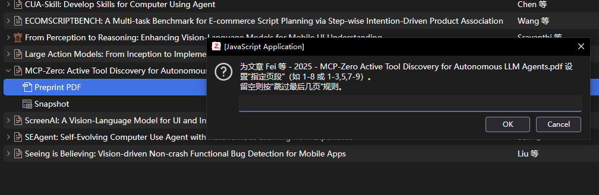

<div align="center">


<h2 id="title">Zotero PDF2zh</h2>

[](https://www.zotero.org/download/)
[](https://github.com/windingwind/zotero-plugin-template)

[](https://github.com/guaguastandup/zotero-pdf2zh/blob/main/LICENSE)
[![zread](https://img.shields.io/badge/Ask_Zread-_.svg?style=flat&color=00b0aa&labelColor=000000&logo=data%3Aimage%2Fsvg%2Bxml%3Bbase64%2CPHN2ZyB3aWR0aD0iMTYiIGhlaWdodD0iMTYiIHZpZXdCb3g9IjAgMCAxNiAxNiIgZmlsbD0ibm9uZSIgeG1sbnM9Imh0dHA6Ly93d3cudzMub3JnLzIwMDAvc3ZnIj4KPHBhdGggZD0iTTQuOTYxNTYgMS42MDAxSDIuMjQxNTZDMS44ODgxIDEuNjAwMSAxLjYwMTU2IDEuODg2NjQgMS42MDE1NiAyLjI0MDFWNC45NjAxQzEuNjAxNTYgNS4zMTM1NiAxLjg4ODEgNS42MDAxIDIuMjQxNTYgNS42MDAxSDQuOTYxNTZDNS4zMTUwMiA1LjYwMDEgNS42MDE1NiA1LjMxMzU2IDUuNjAxNTYgNC45NjAxVjIuMjQwMUM1LjYwMTU2IDEuODg2NjQgNS4zMTUwMiAxLjYwMDEgNC45NjE1NiAxLjYwMDFaIiBmaWxsPSIjZmZmIi8%2BCjxwYXRoIGQ9Ik00Ljk2MTU2IDEwLjM5OTlIMi4yNDE1NkMxLjg4ODEgMTAuMzk5OSAxLjYwMTU2IDEwLjY4NjQgMS42MDE1NiAxMS4wMzk5VjEzLjc1OTlDMS42MDE1NiAxNC4xMTM0IDEuODg4MSAxNC4zOTk5IDIuMjQxNTYgMTQuMzk5OUg0Ljk2MTU2QzUuMzE1MDIgMTQuMzk5OSA1LjYwMTU2IDE0LjExMzQgNS42MDE1NiAxMy43NTk5VjExLjAzOTlDNS42MDE1NiAxMC42ODY0IDUuMzE1MDIgMTAuMzk5OSA0Ljk2MTU2IDEwLjM5OTlaIiBmaWxsPSIjZmZmIi8%2BCjxwYXRoIGQ9Ik0xMy43NTg0IDEuNjAwMUgxMS4wMzg0QzEwLjY4NSAxLjYwMDEgMTAuMzk4NCAxLjg4NjY0IDEwLjM5ODQgMi4yNDAxVjQuOTYwMUMxMC4zOTg0IDUuMzEzNTYgMTAuNjg1IDUuNjAwMSAxMS4wMzg0IDUuNjAwMUgxMy43NTg0QzE0LjExMTkgNS42MDAxIDE0LjM5ODQgNS4zMTM1NiAxNC4zOTg0IDQuOTYwMVYyLjI0MDFDMTQuMzk4NCAxLjg4NjY0IDE0LjExMTkgMS42MDAxIDEzLjc1ODQgMS42MDAxWiIgZmlsbD0iI2ZmZiIvPgo8cGF0aCBkPSJNNCAxMkwxMiA0TDQgMTJaIiBmaWxsPSIjZmZmIi8%2BCjxwYXRoIGQ9Ik00IDEyTDEyIDQiIHN0cm9rZT0iI2ZmZiIgc3Ryb2tlLXdpZHRoPSIxLjUiIHN0cm9rZS1saW5lY2FwPSJyb3VuZCIvPgo8L3N2Zz4K&logoColor=ffffff)](https://zread.ai/guaguastandup/zotero-pdf2zh)

在Zotero中使用[PDF2zh](https://github.com/Byaidu/PDFMathTranslate)和[PDF2zh_next](https://github.com/PDFMathTranslate/PDFMathTranslate-next)

**当前版本信息：** server v3.1.0 | 插件 xpi v3.1.0

**📚 项目文档：** [zotero-pdf2zh.github.io](https://zotero-pdf2zh.github.io)


</div>

# 如何使用本插件

本指南将引导您完成 Zotero PDF2zh 插件的安装和配置。


# 安装说明

## 第一步：安装Zotero

插件目前支持[Zotero 7](https://www.zotero.org/download/)以及Zotero 8(适配 by @[Aphcity](https://github.com/Aphcity))

## 第二步：安装conda

**conda安装**

1. 安装conda
参考本链接安装: https://www.anaconda.com/docs/getting-started/miniconda/install#windows-command-prompt

2. 检查conda安装是否成功
```shell
# 显示conda版本号, 则conda安装完成
# 如果您的conda安装检查失败了，请您优先排查这个问题，不要进行第二步操作。
conda --version
```

## 第三步：下载项目文件

```shell
git clone https://github.com/osoulmate/zotero-pdf2zh.git
```

## 第四步：准备环境并执行

1. **安装依赖**
```shell
conda create -n zotero-pdf2zh python==3.12.0
conda activate zotero-pdf2zh
cd zotero-pdf2zh/server
pip install -r requirements.txt
```

2. **生成xpi插件**

```
cd zotero-pdf2zh/plugin
# node 安装 https://nodejs.org/zh-cn/download
npm install
npm run build
#上面步骤都成功生成的插件可以在zotero-pdf2zh/plugin/build路径下看到，下载并安装到Zotero.
```

3. **启动后端服务**

```shell
cd zotero-pdf2zh/server
python server.py
```

**注意：在zotero端使用PDF2zh翻译功能时需要保持脚本的运行状态,只要需要使用翻译功能，就不要关闭这个Python脚本。**

### 默认配置

执行 `python server.py` 时的默认选项：

| 配置项 | 默认值 | 说明 |
|--------|--------|------|
| 虚拟环境管理 | 开启 | 使用 `uv` 管理 |
| 自动安装依赖 | 开启 | 首次运行自动安装 |
| 自动检查更新 | 开启 | 启动时检查 |
| 更新源 | gitee | 国内用户友好 |
| 端口号 | 8890 | 服务端口 |
| 镜像源 | 中科大 | 加速包安装 |

### 常用命令参数

```shell
# 使用 conda 替代 uv
python server.py --env_tool=conda

# 修改端口号
python server.py --port=9999

# 关闭自动检查更新
python server.py --check_update=False

# 切换更新源为 github
python server.py --update_source="github"

# 关闭镜像加速
python server.py --enable_mirror=False

# 自定义镜像源
python server.py --mirror_source="https://mirrors.tuna.tsinghua.edu.cn/pypi/web/simple/"

# 使用 Windows exe 版本
python server.py --enable_winexe=True --winexe_path='./pdf2zh-v2.6.3-BabelDOC-v0.5.7-win64/pdf2zh/pdf2zh.exe'
```

注意事项: 如果使用uv方法安装，在安装后请不要移动server文件夹，也不要修改文件夹名。


## 第五步：Zotero端插件设置

<div align=center>

</div>


**配置选项说明**

- 切换翻译引擎`pdf2zh/pdf2zh_next`，界面将显示不同引擎的翻译配置

- 关于**qps**和**poolsize**选项：请参考您的服务商（例如[zhipu](https://www.bigmodel.cn/dev/howuse/rate-limits)）。

    >   - 计算公式: `qps = rpm / 60`
    >   - 对于上游为**qps/rpm限速**：pool size = qps * 10;
    >   - 对于上游为**并发数限制**: pool size = max(向下取整(0.9*官方并发数限制), 官方并发数限制-20)，qps = pool size
    >   - 如果您不知道怎么设置, 请直接设置qps即可, pool size设置为默认值0即可

- 翻译引擎pdf2zh的自定义字体：字体文件路径为本地路径。如果采用远端服务器部署，暂时无法使用本配置，则需要手动修改`config.json`文件中的`NOTO_FONT_PATH`字段。

- 目前, 额外配置参数名需要与config文件中的字段相同(例如在pdf2zh_next中, openai对应的额外配置: `openai_temperature`和`openai_send_temperature`与`config.toml`文件中的字段相对应), 本功能将在未来继续优化, 可参考[文档](./server/doc/extraData.md)


**翻译服务说明**

单击LLM API配置管理处的新增，弹出此窗口，进行服务配置。

-   您可以为同一个服务添加多种配置，但是您只能激活其中一种，在翻译时会使用您激活的配置
-   在配置LLM API后，您还需要在上方设置的翻译服务处选择您需要使用的服务

<div align=center>

</div>


**💡 翻译服务介绍**

| 服务类型                | 服务名称         | 服务介绍                                                     | 💡注意事项                                                    |
| ----------------------- | ---------------- | ------------------------------------------------------------ | ------------------------------------------------------------ |
| 免费&免配置的翻译服务   | siliconflowfree  | 基于硅基流动提供的GLM4-9B模型, 仅支持翻译引擎pdf2zh_next，由[@硅基流动](https://www.siliconflow.cn/)、[@pdf2zh_next](https://github.com/PDFMathTranslate/PDFMathTranslate-next) 和 [@BabelDOC](https://github.com/funstory-ai/BabelDOC)联合提供服务 | 1. 此服务无需选择qps，默认为40<br />2.此服务可能会存在漏翻译的情况，如果需要高质量翻译请优先选择其他服务<br />3. 此服务仅支持pdf2zh_next引擎 |
| 免费&免配置的翻译服务   | bing/google      | bing/google的官方机器翻译                                    | bing和goole的翻译服务都存在限流，如果翻译失败，请将并发数设置调至2及以下重试 |
| 具有优惠/赠送的翻译服务 | openaliked       | 加入[火山引擎协作计划](https://console.volcengine.com/ark/region:ark+cn-beijing/openManagement?OpenAuthorizeModal=true&OpenTokenDrawer=false)，个人用户每个模型每天最多赠送50w token | 1. 协作计划的额度赠送规则是：按照前一天参加协作的token量等额计算（例如您昨天使用了10w token，那么今天的赠送额度则为10w token）上限为50w，请注意检查自己的额度使用情况，避免超额<br />2. 此服务支持高并发数：可设置并发数为500~1000 |
| 具有优惠/赠送的翻译服务 | silicon          | 通过邀请好友可以获得14元赠送金额                             | 1. 此服务url需填写为: `https://api.siliconflow.cn/v1`，如果后面有completions等后缀，请删除。<br />2. 此服务免费版支持的线程数较低，建议设置为6左右 |
| 具有优惠/赠送的翻译服务 | zhipu            | 智谱部分模型可支持免费调用                                   | 免费服务的并发数不要设置过高，建议设置为6以内                |
| 高质量服务              | aliyunDashScope  | 翻译效果较好，新用户有赠送额度，可以尝试                     | 选择LLM API配置管理中的默认模型选项                          |
| 高质量服务              | deepseek（推荐） | 翻译效果好，有缓存命中机制                                   | 使用deepseek v3服务即可                                      |

-   除了免费服务，您均需要配置自己的API Key和URL才可以使用翻译服务（某些服务不需要配置URL，可以忽略）
-   您可以根据实际情况自行调整并发数

- **openailiked服务选项**可以填写所有兼容openai格式的LLM服务, 您需要填写您的LLM服务供应商提供的URL, API Key, Model名称等信息。

    - 示例: 火山引擎url填写为`https://ark.cn-beijing.volces.com/api/v3`


## 第六步： 关于翻译选项

在Zotero中对条目/PDF右键，选择PDF2zh-翻译选项，进行翻译。

对条目/附件单击右键, 可以看到四个翻译选项:

<div align=center>

</div>

本仓库相对于原作者仓库新增在选择某个翻译选项（裁剪PDF除外）功能后弹出设置指定翻译页面的功能（优化原仓库仅能全局设置的问题），同时修复原来生成的双语对照PDF左译文右原文为左原文右译文。

特别注意：如仅翻译一页（如第一页），则范围设置为`1-1`，同理第n页为`n-n`。

<div align=center>

</div>

**💡 翻译选项解析**

| 翻译选项                              | 解释                                                         | 示例图片                                                     |
| ------------------------------------- | ------------------------------------------------------------ | ------------------------------------------------------------ |
| **翻译PDF (translate PDF)**           | 点击原文PDF或论文条目, 将会生成在Zotero插件设置端所选择的默认生成文件 |  |
| **裁剪PDF (crop PDF)**                | 选择dual/mono类型附件, 将会对选择的附件在宽度1/2处裁剪, 然后上下拼接, 此功能适合手机阅读<br />注意事项: <br />1. 本选项会将页面两侧空白处进行裁剪<br />2. 若产生截断了原文内容的情况, 可将`server/utils/config.py`中的`config.pdf_w_offset`值降低 |  |
| **双语对照 (compare PDF)**                | 点击此选项, 会生成左边为原文, 右边为翻译后文本的PDF<br />1. 选择"Dual文件翻译页在前"可以交换生成顺序<br />2. 此选项等同于翻译引擎为pdf2zh_next, 且`双语(Dual)文件显示模式`为**Left&Right**时生成的文件 |  |
| **双语对照(裁剪) (crop-compare PDF)** | 此选项仅针对**双栏PDF论文**。它会先将PDF**竖向裁剪为单栏文件**，再左右拼接。 |  |

**您可以多选条目，右键菜单，然后进行批量PDF翻译**

## 第七步: 关于包更新(New)

zotero插件和server脚本均具有自动更新功能, 但是为了使用最新版本babeldoc和pdf2zh_next, 您需要进行下列操作:

0. 进入server文件夹

1. 进入虚拟环境: 名称为`zotero-pdf2zh-next-venv`
```shell
# conda
conda activate zotero-pdf2zh-next-venv

# uv
## MacOS/Linux
source ./zotero-pdf2zh-venv-next/bin/activate
## Windows
.\zotero-pdf2zh-next-venv\Scripts\activate
```

2. 更新
```shell
# conda
pip install --upgrade pdf2zh_next babeldoc

# uv
uv pip install --upgrade pdf2zh_next babeldoc
```

## 声明与致谢 (Acknowledgement)

本项目是基于优秀的开源项目 [zotero-pdf2zh](https://github.com/guaguastandup/zotero-pdf2zh) 的非官方定制化分支 (Unofficial Fork)。

出于 [深度定制的 UI 交互（包括但不限于指定翻译页面）] 的考量，我们对原有代码进行了较大幅度的适配修改。由于这些修改方向与上游主干项目的演进路线不完全一致，因此本项目作为独立分支进行维护，并未向上游提交 PR。

在此，向原项目作者及贡献者们表达最诚挚的感谢！原项目的基础架构为本分支提供了巨大的帮助。

**⚠️ 注意：**
* 本项目为个人/内部定制版本，原作者**不对**本分支产生的任何 Bug 或使用问题负责。
* 如果你需要原版、稳定且功能通用的体验，请务必访问并支持 [官方上游仓库](https://github.com/guaguastandup/zotero-pdf2zh)。
* 本项目严格继承原仓库的 [AGPL] 开源协议，所有底层核心代码的版权归原作者所有。